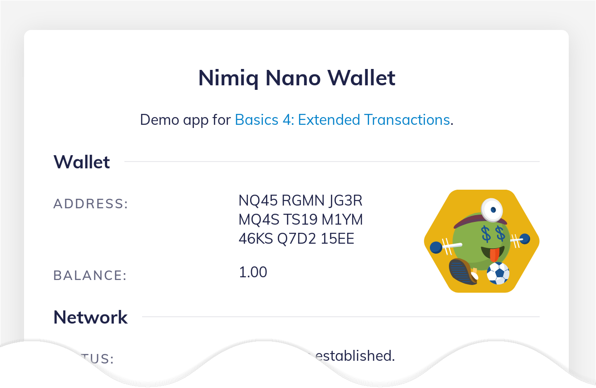

# Basics 5: Nimiq Identicons

_TL;DR? [Run the demo.](playground.html#basics-5-identicons-demo.html)_

Building on the tutorial [Basics 4: Extended Transactions](basics-4-extended-tx),
we can add one of Nimiq's unique features: [Nimiq Identicons](https://github.com/nimiq/identicons).

Identicons help users identify and verify addresses,
for example helping them to make sure that the address they entered is the correct address of the recipient.
Here is an example: the Identicon in the following screen corresponds to the address `NQ45 RGMN JG3R MQ4S TS19 M1YM 46KS Q7D2 15EE`.



First, let's import the Nimiq Identicons library at the top of our script:

```javascript
import Identicons from "https://unpkg.com/@nimiq/identicons@1.5/dist/identicons.bundle.min.js";
```

> **Note:** Nimiq Identicons were named "Iqons" before. Older documents, blog posts
> or some members of the Nimiq Community might refer to them also as Nimiqons or Avatars.

For this to work we take advantage of the `module` type definition by changing the `<script>` tag to:

```html
<script type="module">
```

## An Identicon for our own wallet address

To use the lib, we get the user-friendly address of our wallet and create an Identicon for it.
It's three new lines of code in `start()`:

```javascript
const address = wallet.address.toUserFriendlyAddress();
$('address').textContent = address;
await Identicons.render(address, $('identicon'));
```

This code will create an Identicon as an SVG and place it into a `#identicon' element that we now add to our HTML:

```html
...
<div class="nq-card-body">
    <h2><span>Wallet</span></h2>
    <div id="identicon"></div> <!-- just this line -->
    <p>
        <span class="nq-label">Address: </span>
        <span id="address">loading&hellip;</span></p>
    <p>
...
```

Now, when reloading the web-app, an Identicon will appear there.
Of course a different one for you, because the address of your wallet is different.

## Identicons for sending transactions

In the "Send Transaction" section of our app, let's add a part that visualizes the transaction by
showing an Identicon for the sender, the amount being transferred and another Identicon for the receiver.

First step, some HTML markup just before the `tx_send` button:

```HTML
<div id="transaction">
    ...
    <p id="tx_overview">
        <span id="tx_overview_sender"></span>
        <span> ⇢ </span>
        <span id="tx_overview_amount"></span>
        <span> ⇢ </span>
        <span id="tx_overview_recipient"></span>
    </p>
    ...
</div>
```

Add a new function to generate the "transaction overview".
It extracts the data entered into the transaction form and renders it into the HTML section we added before.
The function will also check if the entered values are valid.
If so, the overview will be shown and the "send" button becomes enabled.

```javascript
async function transactionOverview() {
    let ready = false;
    try {
        // Test if recipient address is valid by converting it forth and back
        const recipientAddress = Nimiq.Address
            .fromUserFriendlyAddress($('tx_recipient').value.trim())
            .toUserFriendlyAddress();

        // Render our own wallet's address as Identicon
        await Identicons.render(nimiq.address, $('tx_overview_sender'));

        // Show the amount to be sent
        const amount = parseFloat($('tx_amount').value || '0');
        $('tx_overview_amount').textContent = `${amount} NIM`;

        // Render the recipient address as Identicon
        await Identicons.render(recipientAddress, $('tx_overview_recipient'));

        // If everything worked until here and a positive amount is set
        // we're ready to show the overview
        ready = amount > 0;

    } catch (error) {
        // a good place to add some proper error handling later on :)
    }

    // Show overview and and enable the send button if ready
    $('transaction').classList.toggle('ready', ready);
    $('tx_send').disabled = !ready;
}
```

Next step, call the `transactionOverview()` function each time
the user enters something into the amount or recipient box
of the transaction form by adding two `input` listeners
at the end of `start()`:

```js
$('tx_amount').addEventListener('input', transactionOverview);
$('tx_recipient').addEventListener('input', transactionOverview);
```

Finally, making it nice with some CSS to
a) show the transaction form only when consensus has been established and
b) show the overview if the entered transactions data is valid.
By folding and unfolding the sections using a little animation:

```css
#transaction {
    max-height: 0;
    overflow: hidden;
    transition: max-height .3s;
}

.consensus-established #transaction {
    max-height: 63rem;
}

#tx_overview {
    /* ... */
    max-height: 0;
    overflow: hidden;
    transition: max-height 1s;
}

#transaction.ready #tx_overview {
    max-height: 21rem;
}
```

Now update the `onConsensusChanged(...)` method so that it adds the `consensus-established` class to show the transaction form:

```js
function onConsensusChanged(consensus) {
    const established = consensus == Nimiq.Client.ConsensusState.ESTABLISHED;
    status(established
        ? 'Consensus established.'
        : 'Establishing consensus...');

    // Add or remove the class depending if consensus is established or not.
    document.body.classList.toggle('consensus-established', established);
}
```

## Awesome!

You are now an official Nimiq Basics Code Nimja (that is _not_ a typo), having mastered the ancient skills of

1. Establishing consensus
1. Listening to blockchain events
1. Sending both types of transactions
1. Last but not least, creating Identicons

As a Nimiq Basics Code Nimja, you can now proudly wear the golden belt of honor!


---

_Find more help and documentation in the [Nimiq Developer Center](https://nimiq.com/developers/).
Share your ideas and feedback on the [Nimiq Community Forum](https://forum.nimiq.community),
you'll also find a dedicated section for [discussions and ideas](https://forum.nimiq.community/c/documentation/drafts).
Or get in touch at [sven@nimiq.com](mailto:sven@nimiq.com)._
