# How to use the Ledger Nano S and Ledger Nano X with Nimiq

## What is a Ledger Nano S or Ledger Nano X?

The [Ledger Nano S](https://shop.ledger.com/products/ledger-nano-s) and
[Ledger Nano X](https://shop.ledger.com/pages/ledger-nano-x) are so called hardware wallets. A hardware wallet is a very secure and at the same time user friendly way to access your funds as the private key to your funds is stored on the hardware wallet device itself and doesn't get leaked. Your funds are safe even when connected to an infected or malicious computer or a phishing/scam web page. If you're holding cryptocurrency worth more than a week's salary we **highly** recommend to get a hardware wallet. It's worth it.

We provide an official Nimiq app for Ledger Nano S and Ledger Nano X devices to manage NIM with the [Nimiq Safe](https://safe.nimiq.com/) application.

## Before you start

Verify you have:

- [Set up Ledger Live](https://support.ledger.com/hc/en-us/articles/360006395233) with your Ledger device.
- [Updated the firmware](https://support.ledgerwallet.com/hc/en-us/articles/360002731113) on your Ledger hardware wallet.

## Install the Nimiq app

1. Open the **Manager** in [Ledger Live](https://ledger.com/live).
2. Connect and unlock your device using your PIN code.
3. If asked, allow the manager to communicate with your device.
4. Find **Nimiq** in the app catalog.

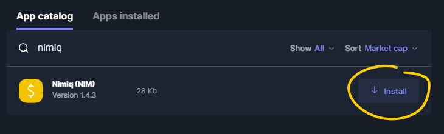

5. Click the **Install** button for the app and wait for the installation process to finish. If the **Install** button is disabled in Ledger Live with the warning that there is not enough storage space left check the solutions in [this article](https://support.ledgerwallet.com/hc/en-us/articles/115005171425-Unable-to-install-application).

## Set up a Ledger account in Nimiq Safe

1. Open [Nimiq Safe](https://safe.nimiq.com/) in your browser.
2. If you don't have any accounts set up in **Safe**, you will be taken to the **Add Account** page immediately.
3. If you already have accounts, click on your **account name** and choose **Add account**.

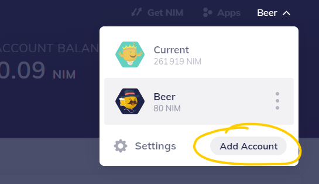

4. Connect and unlock your device using your PIN code, then open the **Nimiq app** on your Ledger.
5. Click on **Connect Ledger** in the **Add Account** page.

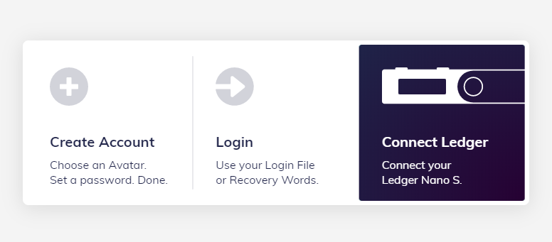

6. If your Ledger device is not correctly connected yet, follow the instructions to connect and unlock it.

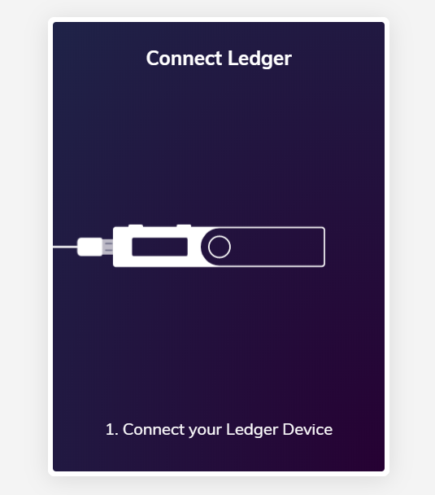

7. The Ledger account will start to **synchronize**.
8. If you already used your Ledger account before, it will get imported. **You are all set up**.
9. If you haven't used your account yet, it will ask you to choose an **identicon** (a little avatar that represents a Nimiq address).

10. **Congratulations**, your account is now created.

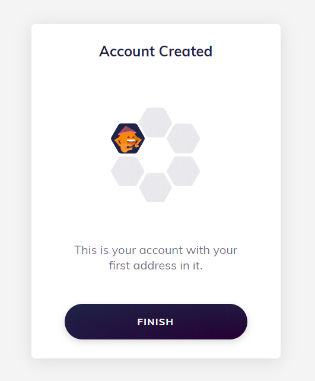

11. Click **Finish** to get back to the **Nimiq Safe**.

> Welcome to the **Nimiq blockchain** !

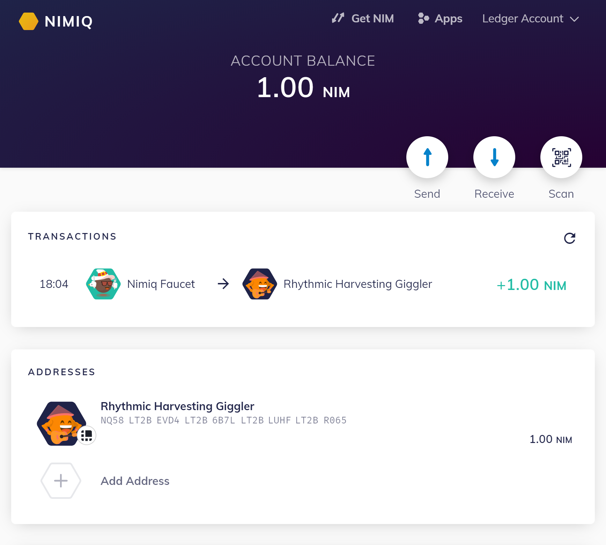

## Send funds from a Nimiq Ledger account

1. Open [Nimiq Safe](https://safe.nimiq.com/) in your browser.
2. Make sure your Ledger account is selected. Otherwise switch to it via the account selector in the header.
3. In the **Addresses** overview, click on the address you want to send from.

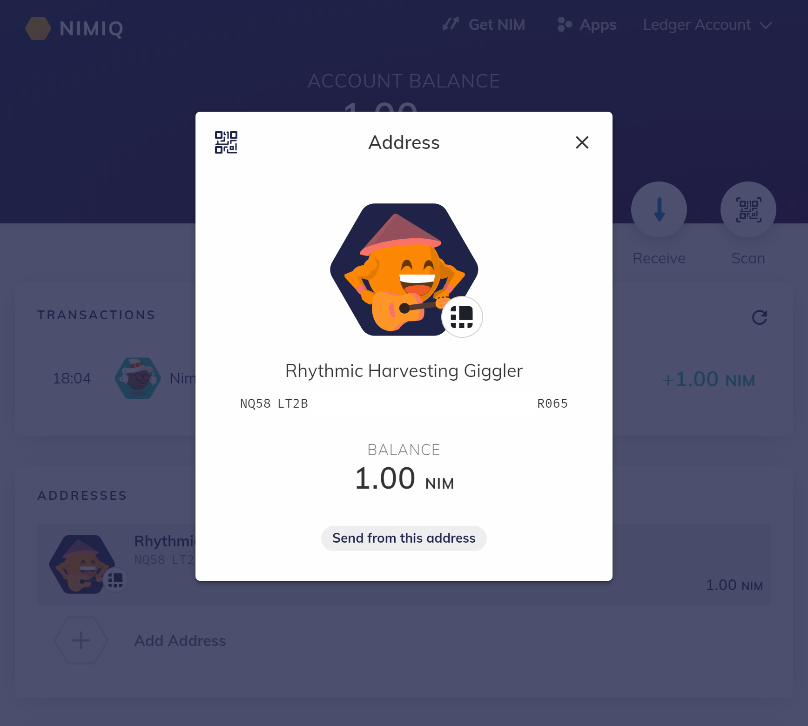

4. Click on **Send from this address** to open the **Send a transaction** window and enter the recipient's Nimiq address you want to send funds to.

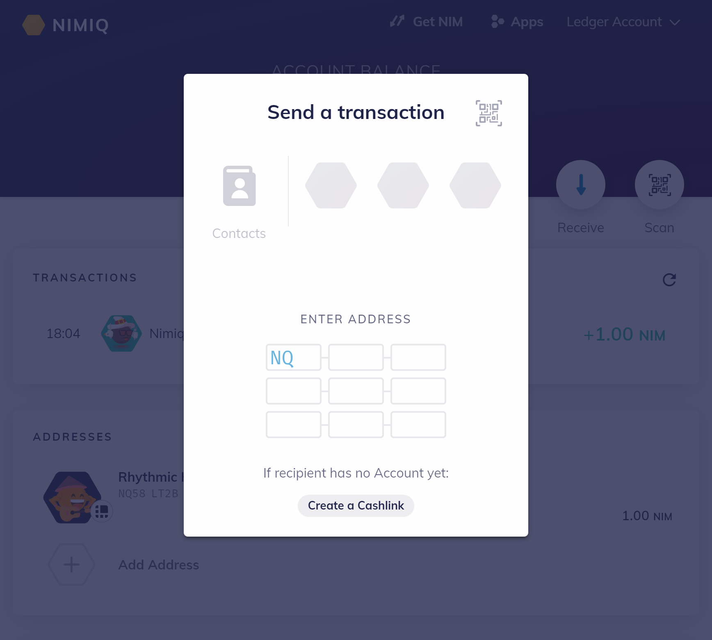

5. Once you entered the address, a new window will appear to save a **Contact**. Enter a name and click **Save & set amount**.

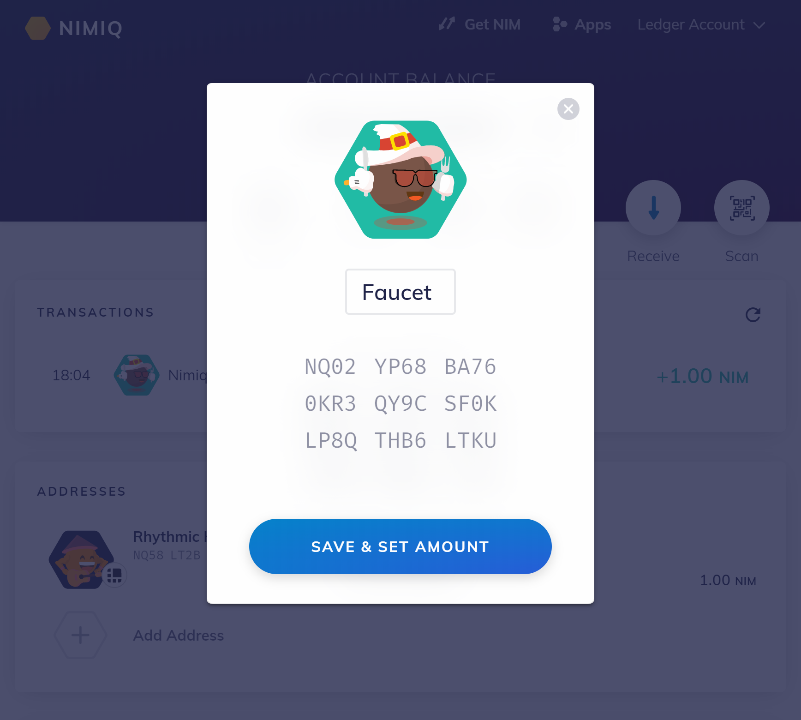

6. Now choose the amount you want to send. You can also add a message if you want. Finally, click **Send transaction**.

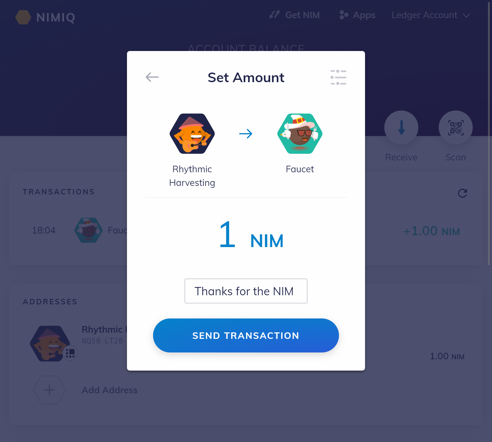

7. A new popup will open, follow the instructions to connect your Ledger device if it is not connected yet.

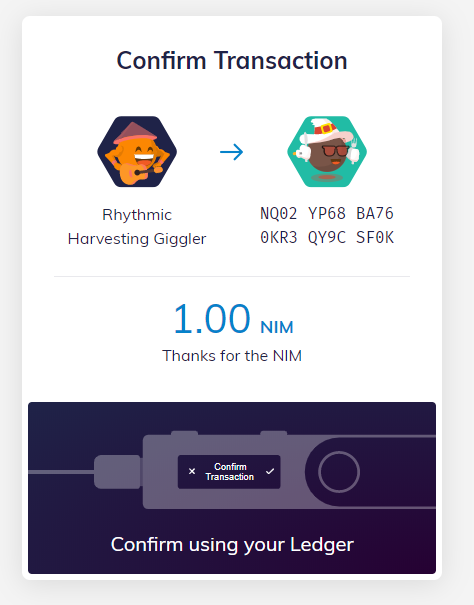

8. You now need to confirm the transaction on your device. Verify the transaction's details and choose **Accept and send** on your device if you want to send the transaction.

> Congratulations! Your transaction has now been sent to the network and should be confirmed soon.

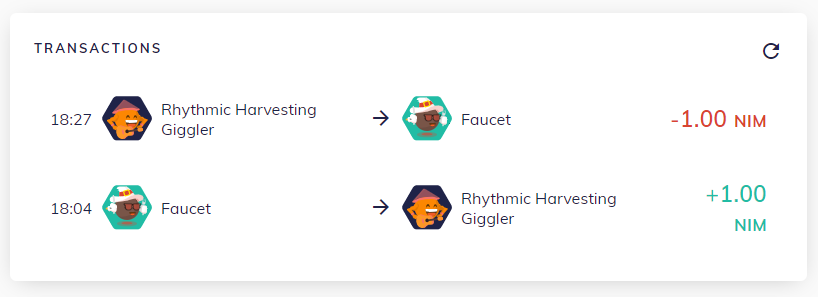

