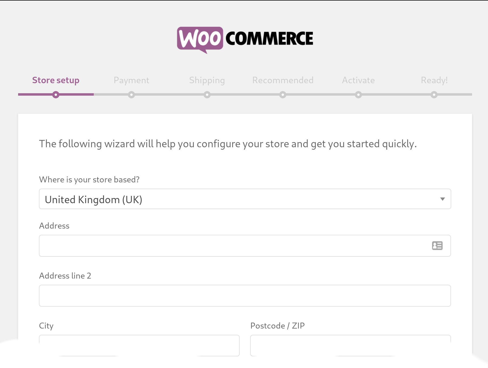

# How to install the Nimiq Payment Plugin for WordPress WooCommerce

WooCommerce is one of the most common online shop systems used on the Web.
Integrated into WordPress, it allows you to quickly set up your own online shop.

_TL;DR? Check out the [Nimiq Shop](https://shop.nimiq.com/) to see the plugin in action._

To get started, you need a WordPress installation somewhere.
If you use a managed service, your provider will have sent you all the details on where you find the login.
If instead you start from scratch with your own server somewhere, then please follow these instructions
[here first](wordpress-woocommerce-installation) to get a WordPress and WooCommerce installation up and running.

The installation will be two steps:

1. [Adding the WooCommerce plugin to WordPress and configuring it](#woocommerce)
1. [Finally, adding the Nimiq plugin plus a quick setup](#nimiq-plugin)

## WooCommerce

Log into the the admin panel of your WordPress installation, usually at `<www.your-server-domain.com>/wp-admin/`,
select _Plugins_ ⇒ _Add New_ ⇒ search for "woocommerce" ⇒ and hit _Install Now_.

After the installation is completed, click _Activate_ and follow the setup process.
FYI, WooCommerce will suggest to install and sign-up for a lot of other third-party plugins.
Take your time and decide wisely. :)

During the process, disable able all other payment options.
A future version of the Nimiq Payment Plugin will work in combination with other payment methods.

## Nimiq Plugin

Before installing the plugin, let's make sure all the requirements are met:

* Using cPanel
  * **PHP 7:** Go to *Software* > *Select PHP Version* and pick "PHP 7"
  
  * **Extensions:** Make sure you have `php-gmp` and `php-mbstring` checked
* Using Docker
  * Type `docker exec`, press [tab] to find your docker WordPress container, press enter to get into the docker container and then follow the instructions below
* Using the terminal for custom installations
  * Note: on Debian and Ubuntu you will to use `apt` as in the examples below, on RedHat, Fedora, and Arch use `dnf` instead of `apt`
  * **PHP 7:** run `php --version`, it should show a version of 7 or higher; If it instead returns "not found", then run `sudo apt -y install php  php-cli php-fpm php-mysqlnd php-zip php-devel php-gd php-mcrypt php-mbstring php-curl php-xml php-pear php-bcmath php-json php-gmp`
  * **Extensions:** run `php -m`, in the returned list, search if you can find `php-gmp` and `php-mbstring`, if not install the   missing extensions by running `apt install -y php-gmp php-mbstring`

If you're not sure, please contact your service provider and ask for support.

After checking the requirements, you can install the Nimiq Payment Plugin by searching for "nimiq" in the same place where you found the WooCommerce plugin before.

After installing it, click _Activate_.

You'll now find the _Nimiq Checkout for WooCommerce_ in the list of installed plugins.
Click _Configure_.

Let's have a look at most important settings and fields:

**Wallet NIM Address:** Enter the Nimiq Address to receive your NIM payments.

**For accepting Bitcoin:** set _BTC xPublic Key_ field (optional)

**For accepting Ethereum:** set the _ETH xPublic Key_ field and the _Etherscan.io API key_ (which you can get at etherscan.io).
We recommend to check the _Re-use ETH addresses_ - otherwise, each order will be paid to a new ETH address and you as the shop owner have to pull all the funds together later resulting in more privacy but also in higher fees.

**Network Mode:** For testing, your can set both, NIM and BTC/ETH, to "Testnet", otherwise to "Mainnet".

**Margin Percentage:** You can set this to a positive number, e.g. to compensate for volatility, or to a negative number to give a discount to crypto users. We recommend leaving it at "0". You should check your local legistlation before changing it.

**Exchange Rate Source:** If you select "Fastspot", then you do not have to enter recommended fees at the bottom, Fastspot will do that for you.

**Validation Interval:** How often (in minutes) the blockchain should be checked if transactions have been confirmed. You can reduce this value if you need fast confirmations. Note, when changing the interval, the plugin needs to be disabled and re-enabled again.

**Behaviour:** Change this if you want to use top-level redirection instead of opening a pop-up, make sure that you have SSL encryption enabled (HTTPS in your address bar).

**Logo:** Upload an image to your WordPress installation first and then copy the link and insert it here. It is not possible to load it from some other website (same domain required).

**Confirmations:** If the good you sell should be delivered as fast as possible and are, for example, not too expensive, then you can reduce the _Confirmations_ for NIM, BTC, and ETH - but not below 1. If in doubt, leave as is.

If you have doubts or something does not work as expected, check the tool tips on the left of each input box for help.

**Finally**, go to _WooCommerce_ ⇒ _Settings_ ⇒ _General_ and select US Dollars or Euros from _Currency_ at the bottom of the page. Selecting "Nimiq (NIM)" will work if you accept NIM only.

---

**Disclaimer**: please check the legal and tax requirements of your country before starting to sell with your shop.
